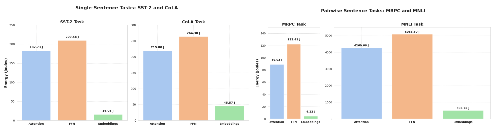
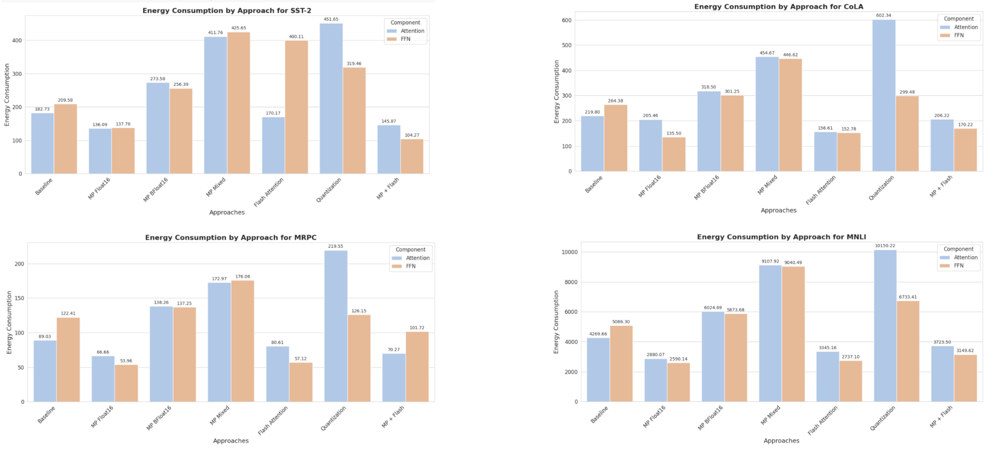
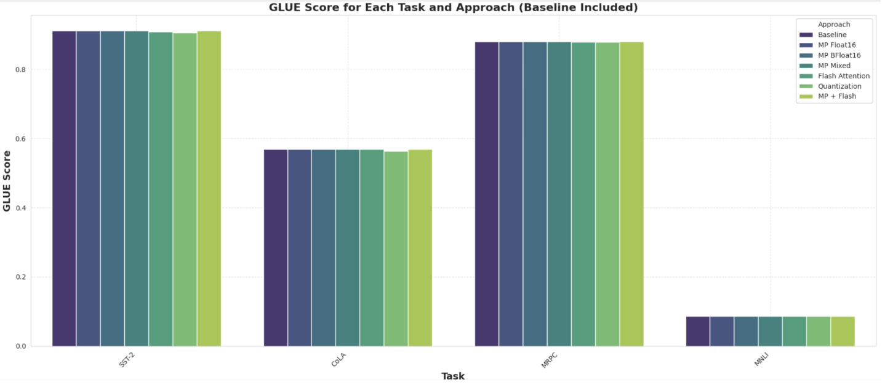
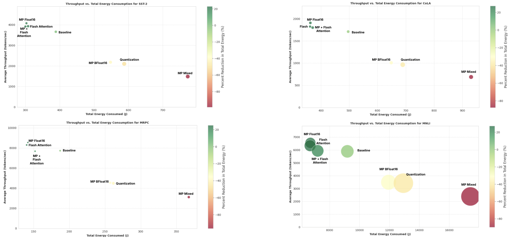

# Optimizing DistilBERT Inference for Energy Efficiency

## Team Members
- Rakene Chowdhury (rc3574)
- Jishan Desai (jd3895)

## Project Description
The rapid proliferation of artificial intelligence (AI) technologies has led to an escalating demand for computational resources, particularly for transformer-based models such as DistilBERT. While much research has focused on training optimizations, the energy efficiency of inference—the phase most relevant for deployment at scale—remains underexplored.

This project investigates inference-time energy optimization of DistilBERT by applying three key techniques:
- **Post-Training Quantization (PTQ)**
- **Mixed Precision Inference**
- **Flash Attention**

Using the General Language Understanding Evaluation (GLUE) benchmark datasets, we analyze the trade-offs between energy efficiency and task-specific accuracy. Energy consumption and carbon emissions were rigorously profiled using **ZeusML**.

### Key Contributions
- Comprehensive benchmarking of DistilBERT inference optimizations on standard GLUE tasks.
- Quantitative analysis of energy consumption and emissions across techniques.
- Identification of effective optimization strategies for sustainable AI inference.

## Code Repository
All code and experiments are contained within `Energy_EfficientBERT_Inference.ipynb`. To reproduce the results:

1. Open the notebook.
2. Execute all cells sequentially.
3. Generated graphs and performance metrics will mirror those reported in the paper.

Additional result visualizations are included in the repository.

## How to Run
Simply run `Energy_EfficientBERT_Inference.ipynb` from top to bottom. All experiments, profiling, and visualizations will be executed automatically.

---

## Results

| Optimization Technique | Energy Impact | Performance Impact | Notes |
|-------------------------|---------------|--------------------|-------|
| Post-Training Quantization (PTQ) | **Increased** energy consumption | Slight degradation | Overhead from quantization/dequantization outweighs theoretical gains. |
| Flash Attention | **Reduced** energy consumption | Maintained accuracy | Efficient memory/computation via kernel optimizations. |
| Mixed Precision (Autocast) | Minimal gains | Variable impact | Frequent fallback to float32 diminishes benefits. |
| Mixed Precision (Float16) + Flash Attention | **Significant reduction** | Maintained accuracy | Synergistic benefits across layers. Most effective strategy. |

Figures:

  
*Figure 1: Baseline performance without optimizations.*

  
*Figure 2: Energy consumption across optimization techniques.*

  
*Figure 3: GLUE benchmark task accuracies.*

  
*Figure 4: Throughput improvements.*

### Key Observations

- **Post-Training Quantization (PTQ):** Contrary to expectations, quantization resulted in *higher* energy consumption. This inefficiency stems from the computational overhead introduced during weight quantization and dequantization. Testing across multiple libraries ruled out framework-specific issues, suggesting intrinsic limitations for attention-heavy tasks (e.g., MNLI, CoLA).

- **Flash Attention:** Achieved *substantial energy reductions* by optimizing memory usage and kernel execution in attention layers. Required inference in float16 or bfloat16 formats, indirectly improving feed-forward network (FFN) efficiency as well.

- **Mixed Precision (Autocast):** Demonstrated *limited energy savings* due to frequent reversion to float32 precision, particularly for tasks requiring higher computational accuracy (e.g., CoLA, MNLI).

- **Mixed Precision (Float16) + Flash Attention:** This combination delivered *the most consistent energy savings* while maintaining high task accuracy. The synergy between optimized attention and reduced precision in FFNs proved highly effective across all evaluated tasks.

---

## Conclusions
Our study emphasizes that:
- **Implementation efficiency is critical**: Optimizations such as Flash Attention and Mixed Precision (Float16) outperform others primarily due to superior kernel and memory handling.
- **Not all optimizations are equal**: While quantization is theoretically attractive, its current implementations introduce prohibitive overheads for inference tasks involving complex attention mechanisms.
- **Energy-efficient AI requires holistic strategies**: Beyond infrastructure-level improvements, model-level optimizations offer substantial opportunities to reduce energy footprints.

Future work could explore *adaptive precision techniques* and *hardware-specific optimizations* to further enhance the sustainability of AI deployments.
